# Position Software Developer

Software Developer
Location: Remote (Must be US-Based) Citizenship: US Citizen Required
Role Overview

We are seeking a Backend Developer to join our team and contribute to the delivery of high-quality software features.

In this role, you will collaborate closely with senior developers to implement and improve our core Python-based infrastructure. We are looking for a developer who excels at feature delivery while **adhering to established architectural patterns**. You will have the opportunity to work across our technology stack, ensuring our applications remain performant and reliable while supporting our long-term technical goals.

## Key Responsibilities

Feature Development: Build and maintain efficient, reusable, and reliable backend code using Python frameworks (Django, Flask, or FastAPI) following established patterns.

Asynchronous Processing: Architect and manage robust task queues (e.g., Celery, RabbitMQ, Redis Pub/Sub, Kafka) to support high-throughput operations.

Implementation & Maintenance: Assist in implementing system architecture decisions, ensuring code quality and maintainability within service-based environments.

System Optimization: Design and manage scalable database systems (Postgres) and implement high-performance caching strategies (Redis)

Implementation: Utilize async programming patterns to maximize application performance.

Collaboration: Work closely with the product and development teams to translate requirements into scalable technical solutions.

## Technical Qualifications

Python Proficiency: 3+ years of professional experience with Python and familiarity with web frameworks like Django, Flask, or FastAPI.

Background Processing: Experience with task queues (e.g., Celery, RabbitMQ, or Kafka) to handle distributed processing.

Database & Caching: Proficiency with Postgres or another relational database and experience developing sophisticated caching strategies using Redis.

Concurrency: Strong understanding of async programming and its application in backend systems.

Version Control (Git): Proficiency in using Git for version control and collaborative software development.

## Preferred Skills (Nice-to-Have)

Kotlin: Prior experience with Kotlin or a desire to work with it as we expand our capabilities.

Service-Oriented Architecture: Experience designing and maintaining microservices or service-based architectures.

Drone/AI Integration: Prior exposure to aerial robotics, drone swarm technologies, or AI-integrated web applications is a significant plus.

Python Tooling: Experience with modern Python tools such as UV, Prek, and Pytest.

ArcGIS: Experience working with ArcGIS mapping software and geospatial data integration.

---

# Backend Developer Interview Prep

## 1. Frame yourself in one line

I'm a full-stack/backend engineer with deep experience building FastAPI and Django services for federal geospatial platforms — including message-queue-driven data pipelines (Kafka), PostgreSQL/PostGIS, MCP server integrations, and AI-integrated features — plus hands-on ArcGIS/ArcPy background

## 2. Backend system with high-throughput or large data volumes.

**ASTRA / Airspace Impact Analysis Platform** 

- Built with FastAPI + Cesium.js, ingesting flight data from FlightRadar24 deliveries, adsb.lol ADS-B archives, and FAA extracts, staged through an Azure blob pipeline (raw → processed → normalized → daily spatial index).

- Before loading any full flight trace, a query service reads a lightweight daily index and narrows candidates down by bounding box and altitude range — everything outside that range is never opened. Same two-phase pattern as a GiST spatial index: cheap filter first, expensive check only on survivors.

- Implemented a 3D spatial intersection engine using line-segment clipping with interpolation (not simple point-in-polygon), so sparse ADS-B sampling doesn't produce false negatives on real airspace crossings — producing precise entry/exit points, crossing duration, and altitude stats.

- The same analysis feeds two outputs: a CZML builder for the Cesium 3D viewer, and a separate narrative/table/figure-library pipeline that assembles an automated NEPA-style PDF compliance report.

- **Talking point on throughput/architecture**: The raw flight archives were huge, so instead of scanning them per query I built an index-first pre-filter — bounding box and altitude range checked against a lightweight daily index before ever touching a full trace file. That's the same principle behind database spatial indexing, just built by hand over flat files, and it's directly the kind of caching/optimization asked with Postgres and Redis.

### ASTRA — airspace impact analysis platform

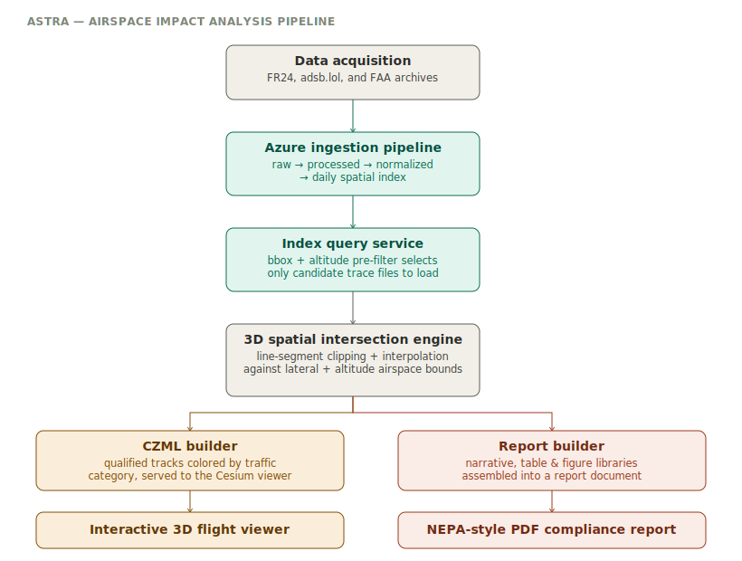

**What it does**

Determines whether historical or proposed flight traffic passes through a designated airspace
volume (a Military Operations Area or other Special Use Airspace), and produces both an
interactive 3D visualization and an automated compliance-style report from the same underlying
analysis — built to support NEPA-style airspace impact assessments.

**Architecture, stage by stage**

1. **Data acquisition** — scripts pull historical flight data from multiple external sources:
   FlightRadar24 (FR24) delivery files, adsb.lol ADS-B archives, and FAA data extracts.
2. **Azure ingestion pipeline** — FR24 deliveries move through a staged pipeline: raw files land
   in blob storage, get extracted/copied into a processed tier, are normalized into a common
   `FlightTrack` JSON schema, and are summarized into a daily spatial index (bounding box,
   altitude range, time window per flight).
3. **Index query service** — before loading any full flight trace, the service reads the
   lightweight daily index and narrows the candidate set down to only the traces whose bounding
   box and altitude range could plausibly intersect the requested airspace volume. Everything
   else is never even opened. *(This is the same two-phase pattern PostGIS uses with GiST
   indexes — cheap bounding-box filter first, precise check only on survivors — applied here to
   flat-file flight archives instead of a database.)*
4. **3D spatial intersection engine** — for each candidate track, flight segments are tested with
   a line-segment clipping approach rather than simple point-in-polygon checks: each segment is
   checked for lateral overlap with the airspace polygon, positions are interpolated along any
   overlapping segment (since sparse ADS-B sampling can otherwise miss a real crossing), and each
   interpolated point is checked against the airspace's altitude band. Only segments passing both
   the lateral and vertical test are kept, producing precise entry/exit points, crossing duration,
   and altitude statistics.
5. **Two outputs from one analysis**:
   - **CZML builder** — converts qualified crossings into CZML, color-coded by traffic category
     (military, air taxi, air carrier, general aviation), served to a Cesium-based 3D viewer.
   - **Report builder** — a separate, composable pipeline (narrative library, table library,
     figure library, all coordinated by an orchestration-only report builder) assembles the same
     underlying analysis into a formatted PDF compliance report.

**Feature Table**

| Requirement | What this project demonstrates |
|---|---|
| Python 3+ | Typed dataclasses, clean service/core/api layering, Shapely-based geometric algorithms |
| System optimization / caching strategies | Index-based bounding-box pre-filtering avoids loading full trace files — the same cheap-filter-then-precise-check pattern as a spatial database index, built by hand over flat files |
| Database & scalable systems | Daily indexed metadata catalog (bounding box, altitude range, time window) functions as a lightweight query layer in front of the raw archive |
| Implementation & maintainability within a service-based environment | Report generation is deliberately split into narrative/table/figure libraries plus an orchestration-only builder — each piece can change independently |
| FastAPI web framework | Routers cleanly separated by domain (airspaces, flights, viewer), each mounted under its own API prefix |
| ArcGIS / geospatial data integration (preferred) | Shapely-based 3D geometric intersection engine handling real airspace volumes (lateral polygon + altitude band), not just 2D point-in-polygon |

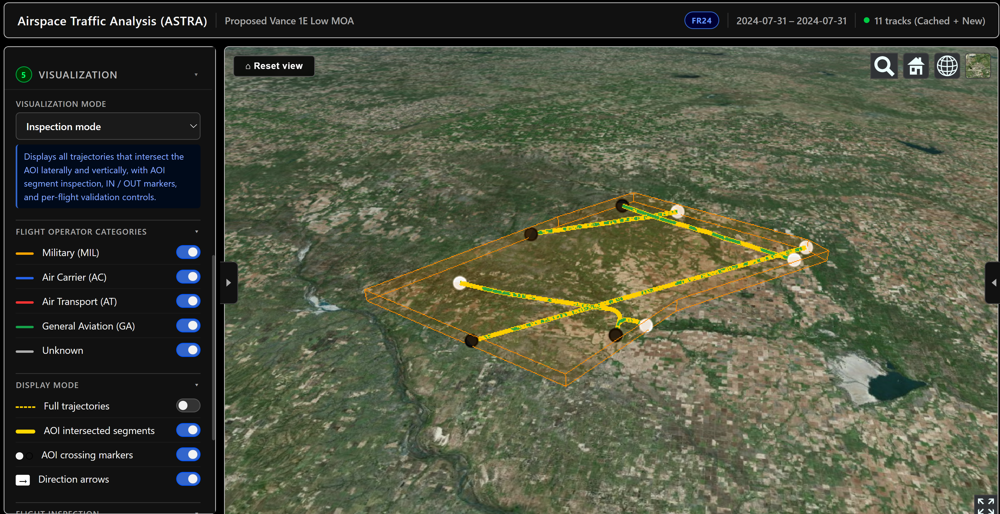

## 3. Service-oriented architecture / microservices

**TerraNexus platform**

- Layered SaaS platform: external connectors (data ingestion from third-party sources), ingestion/canonicalization, scenario modeling, and analytics/orchestration, plus domain-specific applications on top.

- Each layer deployed as its own FastAPI microservice, containerized with Docker.

- Used **Kafka** for event/message passing between ingestion and downstream services, **MongoDB** for flexible document storage, **PostgreSQL/PostGIS** for spatial data.

- Built connector services with async WebSocket transport between services — See [SSE](#what-is-sse) designing service boundaries.

- **Talking point**: "This platform was essentially a service mesh of purpose-built FastAPI microservices coordinated through Kafka — ingestion services publish events, downstream modeling/analytics services consume them. That maps closely to the task-queue/high-throughput requirements."

### TerraNexus — event-driven geospatial intelligence platform

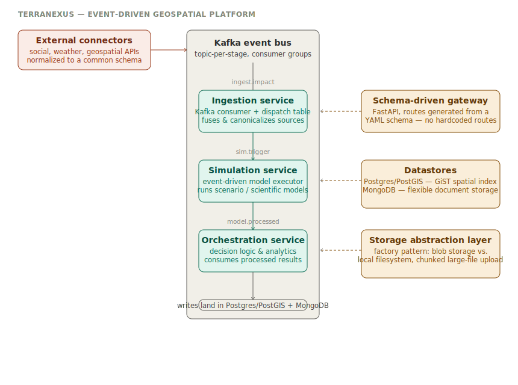

**What it does**

A layered platform that ingests data from multiple external sources, fuses and canonicalizes it,
triggers scientific/scenario models automatically, and surfaces the results through a single
schema-driven API — all coordinated through Kafka rather than direct service-to-service calls.

**Architecture, stage by stage**

1. **External connectors** — independent microservices wrapping social media, weather, and
   geospatial APIs behind a common interface, normalizing each source to a shared schema before
   it enters the pipeline.
2. **Kafka event bus** — the backbone of the whole platform. Every stage is a Kafka consumer
   group reading from one topic and publishing to the next; no service calls another service
   directly.
3. **Ingestion service** — a Kafka consumer with a topic-to-handler dispatch table (a small
   internal router: topic name → handler class), so adding a new data type means registering a
   new handler, not touching the consumer loop. Fuses and canonicalizes incoming data, then
   publishes a trigger event for the modeling stage.
4. **Simulation service** — an event-driven model executor. Listens for trigger events, runs the
   appropriate scientific/scenario model, and publishes the results as a "processed" event.
5. **Orchestration service** — consumes processed events, applies decision logic, and exposes
   analytics — the layer that turns raw model output into something a user-facing app can query.
6. **Schema-driven API gateway** — a FastAPI service with *zero hardcoded routes*; all routing is
   generated at startup from a YAML schema describing each backend service's endpoints. Adding a
   new backend route means editing the schema file, not the gateway code.
7. **Datastores** — Postgres with the PostGIS extension (GiST-indexed geometry columns) for
   spatial data, MongoDB for flexible/semi-structured documents.
8. **Storage abstraction layer** — a factory-pattern wrapper that toggles between cloud blob
   storage and local filesystem based on environment config, with retry logic and chunked upload
   for large raster files (GeoTIFFs).

**Feature Table**

| Requirement | What this project demonstrates |
|---|---|
| Asynchronous processing / task queues (Kafka explicitly listed) | Real `confluent_kafka.Consumer` usage — topic-based consumer groups, dispatch-table routing, async polling loop (`asyncio.sleep` yielding control between polls) |
| Service-oriented architecture / microservices | Every stage (ingestion, simulation, orchestration, gateway, each external connector) is an independently deployable service with its own Dockerfile |
| Database & caching — Postgres, sophisticated strategies | Postgres/PostGIS with GiST spatial indexing; MongoDB for the document side; a dedicated storage abstraction layer for large binary assets |
| Async programming patterns | Consumer loops built on `asyncio`, non-blocking polling with explicit event-loop yields |
| Implementation & maintainability within a service-based environment | Schema-driven gateway (routes generated from YAML, not hardcoded) and dispatch-table pattern in the ingestion service — both are "add a config entry, not new code paths" designs |
| Collaboration / translating requirements into scalable solutions | Platform was designed in explicit layers (ingestion → modeling → orchestration) so each layer's owner can change internals without breaking the topic contracts between them |
| ArcGIS / geospatial data integration (preferred) | PostGIS spatial data model; scientific models covering sea level rise, flood risk, infrastructure condition assessment |

**MCP connector suite** 

- A supporting piece of the same platform's ingestion layer: nine independent MCP servers, each wrapping a different external platform (social media, news, AI research) behind a standardized tool interface, each its own FastAPI service in its own Docker container.

- The data acquisition adapter in front of them has an explicitly documented architectural boundary — it normalizes and passes data through, and deliberately does *not* do storage, dedup, or scoring, so that responsibility stays cleanly downstream.

- **Talking point**: "This is a concrete example of service-boundary discipline

### MCP connector suite — external signal acquisition

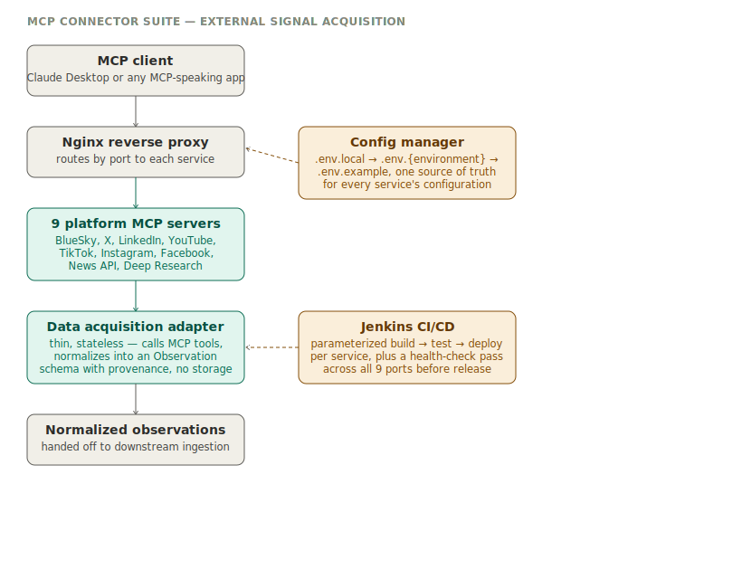

**What it does**

A collection of independent MCP (Model Context Protocol) servers, each wrapping a different
external platform (social media, news, AI-powered research) behind a standardized tool interface,
so any MCP-speaking client can pull external signals through one consistent protocol instead of
integrating against nine different third-party APIs directly. Built as the external "sensing"
layer for the TerraNexus platform's ingestion pipeline.

**Architecture, stage by stage**

1. **MCP client** — any MCP-speaking application (Claude Desktop, or a service inside TerraNexus)
   connects to the suite as a set of remote tools.
2. **Nginx reverse proxy** — sits in front of all nine services, routing by port, with structured
   access logging that captures upstream connect/response timing per request.
3. **Nine platform MCP servers** — each is an independent FastAPI service (BlueSky, X/Twitter,
   LinkedIn, YouTube, TikTok, Instagram, Facebook, a news aggregation service, and an AI-powered
   deep research service), each in its own Docker container, each wrapping a third-party scraping
   or search API behind a common MCP tool-call interface.
4. **Data acquisition adapter** — a deliberately thin, stateless layer with a documented
   architectural boundary: it calls the upstream MCP servers, normalizes whatever comes back into
   a small, consistent "Observation" schema with source provenance attached, and explicitly does
   **not** do durable storage, deduplication, confidence scoring, or cross-source analysis — that
   responsibility is pushed downstream on purpose, so this layer stays swappable and easy to reason
   about.
5. **Normalized observations** are handed off to downstream ingestion, where storage, indexing,
   and analysis actually happen.

Two supporting systems run alongside the main flow:
- **Config manager** — a single source of truth for every service's configuration, with a layered
  precedence (`local` overrides `environment` overrides `example` defaults), so the same codebase
  runs correctly across local dev, staging, and production without code changes.
- **Jenkins CI/CD** — a parameterized pipeline that can build, test, and deploy any subset of the
  nine services independently, followed by a health-check pass across all service ports before a
  deployment is considered complete.

**Feature Table**

| Requirement | What this project demonstrates |
|---|---|
| Service-oriented architecture / microservices (preferred) | Nine independently deployable FastAPI services, each with its own Dockerfile, each swappable without touching the others |
| Implementation & maintainability within a service-based environment | The acquisition adapter's boundary is explicitly documented — what it does and, just as importantly, what it deliberately does *not* do — so the architecture stays legible as it grows |
| System architecture decisions | Layered environment configuration (local → environment → example) as a single source of truth, rather than config scattered per service |
| Version control / collaborative development (Git) | Parameterized Jenkins pipeline supports per-service builds, forced rebuilds, and selective deployment, backed by a health-check gate before release |
| FastAPI web framework | Every one of the nine services is built on FastAPI |
| Async programming patterns | Services use `aiohttp` for non-blocking upstream API calls and expose WebSocket endpoints alongside REST |

**Talking point**

Lead with the *architectural boundary* documentation in the acquisition adapter when "adhering to
established architectural patterns" comes up — it's a concrete example of deciding, in writing,
what a service is and isn't responsible for (acquire and normalize, don't store or score), which
is exactly the kind of discipline that keeps a service-oriented system maintainable as more
services get added. 

## 4. Django projects

**SoloGrow**

- Django-based mentoring platform: mentor/mentee roles, Google Calendar OAuth integration, Stripe payments, and an AI mentor chat feature built on the Anthropic API (with full conversation history maintained server-side).

- Handled real production concerns: OAuth refresh token edge cases, CI/CD via GitHub Actions to GCP, Nginx + Gunicorn + PostgreSQL + Let's Encrypt in production, layered settings (`settings_base.py` → `settings_production.py`).

- **Talking point**: I've taken a Django app from local dev all the way through a real deployment pipeline — Gunicorn behind Nginx, Postgres, SSL — so I'm comfortable with both the framework and what it takes to run it reliably in production.

[Sologrow](https://sologrow.us/)

[Acupuncture & Wellness of Palm Beaches](https://acupb.com/)

## 5. Async programming in Python

- Point to FastAPI work (async by default) across ASTRA and TerraNexus microservices — async endpoints for I/O-bound operations like fetching/parsing large flight archives and spatial queries.

- *I haven't used Celery directly in production, but I've built the equivalent pattern with Kafka-based async processing between services in TerraNexus — producer/consumer decoupling, idempotent processing, retry handling. I'd expect the concepts to transfer quickly, and I'm comfortable ramping up on Celery/RabbitMQ specifically.*

## 6. GIS/ArcGIS background

**Sea Level Rise projects (Mayport, Newport), ArcPy work**

- Built DoD sea level rise assessment tools using ArcGIS Pro automation, IDW/spatial interpolation, LiDAR data processing, and automated layout generation via ArcPy.

### Mayport Sea Level Rise — ArcGIS pipeline

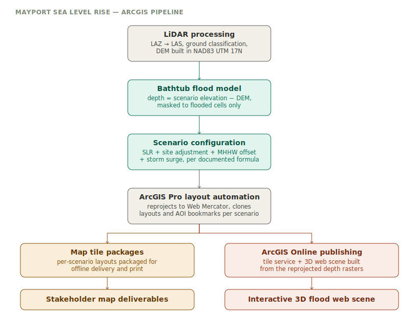

**What it does**

Turns raw LiDAR point cloud data and documented sea level rise projections into scenario-based
flood depth maps for a DoD coastal installation, then packages and publishes those results both
as offline map deliverables and as interactive 3D web scenes.

**Architecture, stage by stage**

1. **LiDAR processing** — compressed LAZ point cloud tiles are converted to LAS, cleaned (VLRs
   and extra bytes stripped, points rearranged for spatial indexing), and built into a LAS
   dataset in NAD83 UTM Zone 17N, from which a bare-earth DEM is derived.
2. **Bathtub flood model** — for each SLR scenario, a depth raster is computed as scenario water
   elevation minus DEM elevation, masked with a conditional raster operation so only cells below
   the scenario water level are kept. Every scenario is produced in both meters and feet.
3. **Scenario configuration** — SLR scenario elevations aren't hardcoded numbers; each one is
   documented against the source methodology (global SLR projection + site-specific adjustments +
   MHHW offset + extreme water level), with the underlying storm event data (e.g., Hurricane
   Matthew and Irma observed storm tides) kept alongside the config for traceability.
4. **ArcGIS Pro layout automation** — depth rasters are reprojected to Web Mercator for web
   sharing, AOI bookmarks are copied between maps programmatically, and new layouts are cloned
   per scenario rather than built by hand each time.
5. **Two delivery paths from the same processed data**:
   - **Map tile packages** — per-scenario layouts packaged for offline delivery and print.
   - **ArcGIS Online publishing** — the same reprojected depth rasters are published as a tile
     service and assembled into an interactive 3D web scene for stakeholder review.

**Feature Table**

| Requirement | What this project demonstrates |
|---|---|
| Python proficiency | Modular ArcPy automation split across LiDAR processing, flood modeling, config, and publishing — not one monolithic script |
| System optimization / scalable processing | LAS point-cloud cleanup (VLR/extra-byte removal, point rearrangement) done once as a preprocessing step specifically to make downstream DEM generation faster |
| Implementation & maintainability | Scenario elevations and their derivations live in one documented config module, not scattered magic numbers — changing a projection methodology means editing one file |
| Collaboration / translating requirements into technical solutions | Scenario values are traceable back to the source methodology (SLR + adjustments + MHHW + storm data), so a reviewer can audit *why* a number is what it is |
| ArcGIS (preferred skill) | Full ArcPy pipeline: point cloud processing, raster algebra for flood modeling, layout/bookmark automation, and ArcGIS Online publishing via the `arcgis` Python API |

**Talking point**

This project is a good answer whenever "maintainability" or "established architectural patterns"
comes up — the scenario configuration is deliberately separated from the processing logic, so a
reviewer, a new SLR projection update, or a change in methodology touches one config file instead
of hunting through the code for hardcoded elevation values. That's the same principle the JD is
asking about with "adhering to established architectural patterns," just applied to a geospatial
domain instead of a typical backend service.

[Open Mayport SLR Medium 100 Year 2065 PDF](Layout_SLR_High_2065_Depth_Feet_WebMercator.pdf)

[Open Mayport SLR Medium 100 Year 2065 PDF](Layout_SLR_Medium_100_Year_2065_Depth_Feet_WebMercator.pdf)

### Manila Bay Reclamation 

Built a Cesium/Three.js 3D digital-twin viewer and a 4D hydrodynamic visualization tool — processing hundreds of millions of records from MATLAB/Delft3D models through Python pipelines with checkpoint/resume logic.

**Talking point**: "Checkpoint/resume was essential there — some of those pipelines ran for hours over massive GDB files, so I built in resumability rather than re-running from scratch on failure. That's the same reliability mindset you'd want in a task-queue-driven system.

https://gdsdemo-manilabay-app.salmonground-0af27677.eastus.azurecontainerapps.io/login

### MATLAB → ArcGIS FGDB pipeline

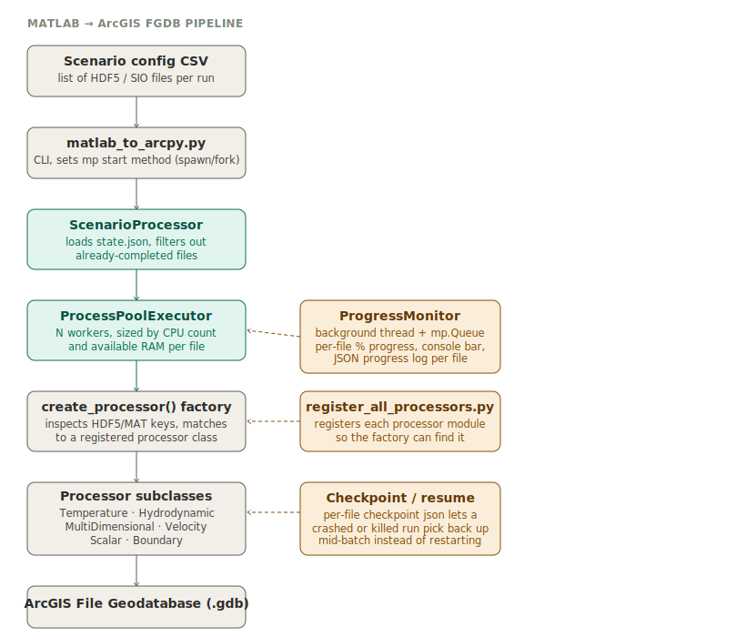

**What it does**

Converts large batches of MATLAB-exported HDF5/SIO simulation output (hydrodynamic, temperature,
velocity, scalar, and boundary datasets) into ArcGIS File Geodatabases, one geodatabase per input
file, at production scale — hundreds of files per scenario, each requiring its own resumable job.

**Architecture, stage by stage**

1. **Config CSV** — each scenario is defined as a list of input files in a CSV job list.
2. **CLI entrypoint** (`matlab_to_arcpy.py`) — sets the correct multiprocessing start method
   per OS (`spawn` on Windows, `fork` on Unix) and kicks off one `ScenarioProcessor` per CSV.
3. **`ScenarioProcessor`** — loads a persisted `state.json`, filters out files already marked
   complete, and only submits the remaining work.
4. **`ProcessPoolExecutor`** — parallel worker processes, sized dynamically from CPU count and
   available RAM per file (memory-aware scheduling, not a fixed worker count).
5. **Factory dispatch (`create_processor`)** — opens the file, inspects which fields are present,
   and matches it to the correct registered processor class (Temperature, Hydrodynamic,
   MultiDimensional, Velocity, Scalar, Boundary) — a strategy/factory pattern rather than
   hardcoded branching.
6. **`register_all_processors.py`** — a lightweight plugin registry: importing this module
   registers every processor implementation with the factory, so adding a new data type means
   adding a new module, not touching the dispatch logic.
7. **Output** — each processor writes an ArcGIS shapefile via `arcpy`/`fiona`, merged into a
   per-file File Geodatabase.

Two cross-cutting concerns run alongside the main flow:
- **`ProgressMonitor`** — a background thread reading off an `mp.Queue`, aggregating per-file
  progress into console output, log files, and JSON snapshots — pluggable via custom handlers
  (a console progress bar and a websocket handler are both implemented as swappable handlers).
- **Checkpointing** — every file's processing state is persisted, so a killed or crashed run
  resumes mid-batch instead of reprocessing everything.

**Feature Table**

| Requirement | What this project demonstrates |
|---|---|
| Python proficiency | Full OOP pipeline: base processor class, six subclasses, factory pattern, CLI via argparse |
| Task queues / distributed processing | `ProcessPoolExecutor` + `mp.Queue` coordination — not Celery/Kafka, but the same producer/consumer, backpressure-aware shape |
| System optimization at scale | Worker count derived from CPU cores and RAM budget per file, not a static number |
| Implementation & maintainability | Plugin-style processor registry (`register_all_processors.py`) — new data types register themselves rather than requiring changes to dispatch code |
| Reliability under long-running jobs | Per-file JSON checkpointing enables resume after failure — critical when a scenario run can be hours long |
| ArcGIS (preferred skill) | Direct `arcpy` integration, File Geodatabase creation, ArcGIS Pro conda environment |

## 7. AI-integrated applications

**SoloGrow AI mentor feature**

- Built an AI mentor chat feature parallel to the human-mentor flow, using the Anthropic API with full conversation history, a dedicated chat UI, and Stripe checkout tied to AI mentor access.

- This is a direct, current example matching their "AI-integrated web applications" nice-to-have.

**WebGPU RAG knowledge graph (prototype)**

- A second, different flavor of AI integration — a full retrieval-augmented generation pipeline (chunking, embedding index, vector retrieval, in-browser LLM generation) running entirely client-side via WebGPU, no backend or API key required.

- Worth mentioning as a contrast to SoloGrow: this one shows understanding the RAG pattern itself (retrieval → grounding → generation), not just calling a hosted API. Caveat that it's a JavaScript/React prototype, not Python.

- This is a prototype, and it's JavaScript/React, it's a good example of architectural instinct (worker-thread offloading, modular pipeline design) that happens to be language-agnostic. 

### WebGPU RAG knowledge graph

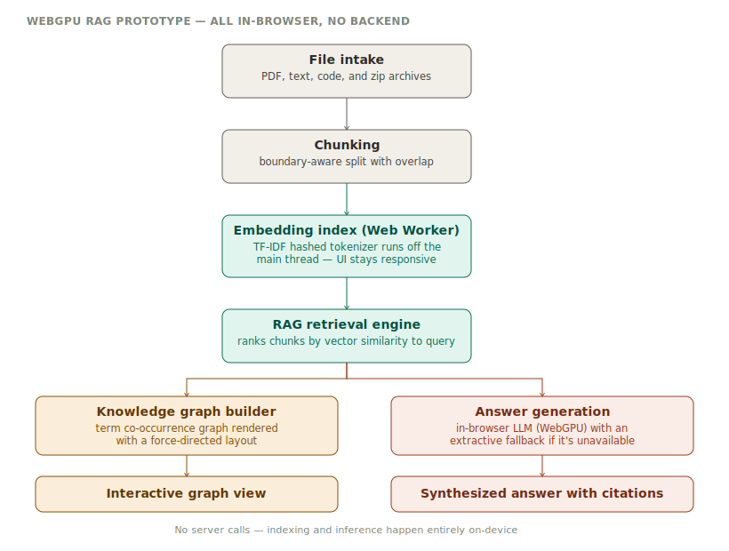

**What it does**

A retrieval-augmented generation (RAG) tool that runs entirely in the browser: drop in PDFs, code,
or text files, and it builds a searchable semantic index, a visual knowledge graph of terms, and
answers questions about the documents using a language model — all without a backend server or
API key, since both the retrieval and the generation happen on-device via WebGPU.

**Architecture, stage by stage**

1. **File intake** — accepts PDFs (parsed client-side via `pdfjs-dist`), plain text/code files, and
   zip archives (`jszip`), with a text-cleanup pass to normalize extracted content.
2. **Chunking** — splits documents into overlapping chunks, snapping breaks to sentence or word
   boundaries where possible rather than cutting mid-word.
3. **Embedding index (Web Worker)** — a TF-IDF hashed tokenizer builds the semantic index inside a
   dedicated Web Worker, off the main thread, so indexing a large file doesn't freeze the UI.
4. **RAG retrieval engine** — embeds the query the same way, ranks all chunks by vector similarity,
   and returns the top-K most relevant.
5. **Two consumers of the same retrieved chunks**:
   - **Knowledge graph builder** — extracts term co-occurrence relationships across chunks and
     renders them as an interactive force-directed graph.
   - **Answer generation** — builds a grounded prompt from the retrieved chunks and runs it
     through an in-browser LLM (`@mlc-ai/web-llm`, WebGPU-accelerated, tested against several
     small instruction models for the best size/quality tradeoff), with an extractive,
     non-LLM synthesis path as a fallback.

**Feature Table**

| Requirement | What this project demonstrates |
|---|---|
| AI-integrated web applications | A full RAG pipeline including retrieval, grounding, and generation, running against a real LLM |
| Async / concurrency thinking | Web Worker offloading for the embedding index keeps the UI thread responsive during heavy computation — same motivation as async I/O in a backend, applied client-side |
| Service-oriented / modular design | Each concern (file intake, chunking, embeddings, retrieval, graph building, generation) lives in its own module with a narrow interface — the same separation-of-concerns instinct that backend service boundaries require |

To run: npm run dev

## 8. Redis caching strategies

- Cache-aside (lazy loading): app checks cache first, falls back to DB, writes result to cache.

- Write-through vs. write-behind caching.

- TTL/eviction policies (LRU, LFU) and cache invalidation strategies — the classic "two hard things in computer science" joke is fine to make here.

- Using Redis for more than caching: session storage, rate limiting, pub/sub, and as a lightweight task broker for Celery.

**DFLOW** : a Django/GeoDjango storm surge model verification app using `django-redis` as the cache backend. Cache-aside for UI facet options, composite-key caching for expensive NetCDF-derived graph computations, and Redis also backing Django's session store. This is your go-to answer when caching questions get specific — it has a real, slightly-blunt invalidation tradeoff (`cache.clear()` on every home load) that's worth naming honestly if asked.

### DFlow — storm surge model verification app

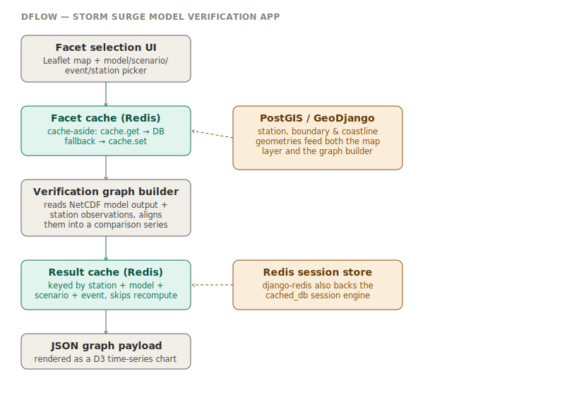

**What it does**

A Django/GeoDjango web application that lets a user pick a hydrodynamic model, scenario, storm
event, and observation station on a Leaflet map, then generates a time-series comparison graph of
modeled storm surge/water level against real station observations — used to verify how well a
DFlow/Delft3D model run matches what actually happened during a given storm.

**Architecture, stage by stage**

1. **Facet selection UI** — a Leaflet-based map lets the user pick model, scenario, event category,
   storm event, and station; the available options for each dropdown come from a shared "facets"
   structure rather than being queried fresh on every request.
2. **Facet cache (Redis)** — `get_globals()` is a textbook cache-aside implementation: check
   `cache.get("facets")` first, and only fall back to querying the database to rebuild the facet
   options if the cache misses, then write the result back with `cache.set()`.
3. **Verification graph builder** — reads model output directly from NetCDF files (`netCDF4`) and
   pulls the matching station observation records, aligns them on a common time axis, and produces
   a structured comparison series.
4. **Result cache (Redis)** — the built graph data is cached under a composite key
   (`station_id + model + scenario + prediction_type + event`), so re-requesting the same
   station/scenario/event combination skips the NetCDF read and recomputation entirely.
5. **Output** — the cached or freshly-built graph payload is returned as JSON and rendered
   client-side as a D3 time-series chart.

Two things run alongside the main flow:
- **PostGIS / GeoDjango** — station locations, coastline, and bay/boundary geometries are modeled
  as real PostGIS geometry fields (`gismodels.PolygonField`, `MultiPolygonField`), feeding both the
  Leaflet map layer and the station lookups the graph builder needs.
- **Redis session store** — the same `django-redis` cache backend also backs Django's
  `cached_db` session engine, so sessions and application-level caching share one Redis instance.

**Feature Table**

| Requirement | What this project demonstrates |
|---|---|
| Database & caching — Postgres, sophisticated caching strategies using Redis | Real `django_redis.cache.RedisCache` backend, used for cache-aside facet loading, composite-key result caching, and serialized-queryset caching — not just configured, actually load-bearing in the request path |
| Django web framework | Full Django project: GeoDjango models, class-based views, management commands, custom serializers |
| Python proficiency, 3+ years | NetCDF scientific data handling (`netCDF4`, `scipy.interpolate`, `pandas`) combined with a standard Django app structure |
| Database & scalable systems (Postgres) | PostGIS-backed geometry models for spatial station/boundary data, queried through GeoDjango's ORM |
| Implementation & maintainability | Facet and result caching are isolated in small, focused functions (`get_globals`, per-station cache keys) rather than scattered inline through views |

### Multi-tenant leak survey mapping — real-time workflow

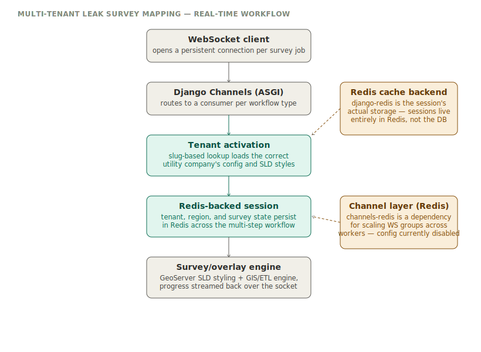

**What it does**

A multi-tenant Django application used by gas utility companies to generate leak-survey maps and
map overlays — each tenant (utility company) has its own configuration, GeoServer SLD styling, and
data model overrides, and survey/overlay generation runs as a real-time, multi-step workflow over
a WebSocket connection rather than a single blocking request.

**Architecture, stage by stage**

1. **WebSocket client** — the browser opens a persistent connection for the duration of a survey
   or overlay generation job, rather than polling.
2. **Django Channels (ASGI)** — routes each connection to the right consumer
   (`SurveyMapConsumer`, `OverlayConsumer`, `DeleteOverlayConsumer`, `OverlayLegendConsumer`)
   based on the workflow being run.
3. **Tenant activation** — a slug identifies which utility company (Southwest Gas Nevada, Texas,
   Philippines; Vectren; others) is connecting, and loads that tenant's specific config file, SLD
   styles, and model overrides — each tenant is its own folder with its own settings, not a shared
   config with conditionals.
4. **Redis-backed session** — as the multi-step workflow runs (engine startup → tenant config
   parsing → GeoServer styling → generation), state like region, survey name, and copyright is
   written into `self.scope["session"]`, which is backed entirely by Redis rather than the
   database.
5. **Survey/overlay generation engine** — drives GeoServer SLD styling and the underlying GIS/ETL
   engine, streaming progress messages back to the client over the same socket as each step
   completes.

**A different Redis pattern than DFLOW — worth knowing the distinction**

DFLOW uses Redis as an **explicit cache-aside layer**: application code calls `cache.get()` /
`cache.set()` around expensive computations. This project uses Redis differently —
`SESSION_ENGINE = "django.contrib.sessions.backends.cache"` means Django sessions live **entirely**
in Redis, not the database at all. There's no explicit `cache.get`/`cache.set` call anywhere in
the view code; the caching is structural, baked into how Django's session framework is configured,
which matters specifically because a WebSocket-driven, multi-step, per-tenant workflow needs
durable, fast per-connection state between steps.

**Also worth being precise about in the interview**: `channels-redis` is a real dependency in
`requirements.txt`, and a Redis-backed `CHANNEL_LAYERS` config exists in the settings file — but
it's currently commented out. That configuration would enable Redis-backed WebSocket group
messaging for horizontal scaling across multiple workers. As it stands in this codebase snapshot,
it's scaffolded but not active — be ready to say exactly that if asked, rather than overclaiming a
distributed pub/sub layer that isn't currently wired in.

**Feature Table**

| Requirement | What this project demonstrates |
|---|---|
| Database & caching — sophisticated caching strategies using Redis | A second, structurally different Redis pattern from DFLOW: Redis as the full session backend for a stateful, multi-step real-time workflow, not just a cache-aside wrapper |
| Async programming patterns | Django Channels / ASGI — WebSocket handling is inherently async-first, distinct from the synchronous request/response pattern in DFLOW |
| Service-oriented / multi-tenant architecture | Each tenant is a self-contained module (own config, own SLD styles, own model overrides) activated dynamically by slug at connection time |
| Implementation & maintainability | Tenant-specific customization lives in per-tenant folders and config files rather than branching logic scattered through shared views |

**Talking point**

Use this project specifically to show Redis breadth, not just repetition of the DFLOW story: "I've
used Redis two different ways — as an explicit cache-aside layer in one project, and as the actual
backing store for session state in a real-time, multi-tenant WebSocket workflow in another. The
second one mattered because the workflow is stateful across multiple steps, and needed something
faster and more ephemeral than the database for that." That's a stronger answer than describing
either project alone.

### Async Python patterns

- `async`/`await`, event loop, `asyncio.gather` for concurrent I/O.

- Why async matters for I/O-bound work (DB calls, external API calls) vs. CPU-bound work (where you'd want multiprocessing or offloading to a worker queue instead).

- FastAPI's native async support — you can speak to this directly from your ASTRA and TerraNexus work.

## 9. gnarly debug across a distributed/service system.

**3D viewer debugging (NAVFAC platform)**

- Debugged text sprite rendering issues in geocentric (ECEF) space vs. local/visual coordinate systems — a subtle cross-system coordinate mismatch bug.

- Built a PostMessage API for parent-child iframe communication, scene versioning with save/load, and movement history/undo — shows you can reason about state synchronization across service/component boundaries, which is core to distributed backend work too.

## 10. SAR - geospatial-intelligence or remote-sensing 

**What it does**

Detects pixel-level change between two or more satellite images of the same location taken at
different times — the general technique behind before/after damage assessment, flood extent
mapping, deforestation tracking, or urban change monitoring. Takes raw satellite tiles and
metadata in, produces difference maps, binary change masks, visual overlays, and summary reports
out.

**Architecture, stage by stage**

1. **Tile merge** — raw satellite tiles for a given AOI and date are mosaicked into a single
   full-frame GeoTIFF using `rasterio.merge`, grouped by a filename pattern encoding
   before/after, sequence, and date.
2. **Metadata grouping** — image records (from NDJSON/JSONL/JSON metadata) are grouped by tile and
   region — satellite platform is deliberately ignored at this stage so images from different
   satellites covering the same location can still be paired — then sorted chronologically.
3. **Sequential comparison** — for a time series of images at one location, consecutive pairs are
   compared in order (t1→t2, t2→t3, …) rather than every-pair-against-every-pair, which keeps the
   output meaningful as a timeline rather than a combinatorial mess. AOI clipping is applied when
   the imagery is georeferenced.
4. **Diff, threshold, mask** — a pixel-wise absolute difference is computed between each pair,
   thresholded into a binary change mask, and rendered as a red-highlight overlay on the base
   image for quick visual review.
5. **Output** — per-pair diff/mask/overlay images, plus a CSV and JSON summary and a run report
   for QA and downstream automation.

A storage abstraction sits underneath the whole pipeline: the same processing code runs against
either a local directory or an Azure Blob Storage container, selected by a CLI flag — the
comparison logic doesn't know or care which one it's reading from.

# Questions to Ask Them

- What does the current task queue setup look like — Celery with RabbitMQ or Redis as the broker? Are you using it mainly for background jobs, or also for real-time/high-throughput pipelines?

- How is the service-oriented architecture split today — is it a handful of larger services or a broader microservices footprint?

- You mentioned drone swarm/aerial robotics integration — is that an active initiative, or more exploratory at this point?

- What does the caching layer look like in production — mostly cache-aside, or are there write-through patterns for specific data?

- Since this is remote and US-citizen-required, is that tied to a specific federal contract, similar to DoD/NAVFAC-type work? (this lets you naturally mention your federal contracting background)

# Reference Curent Firm

  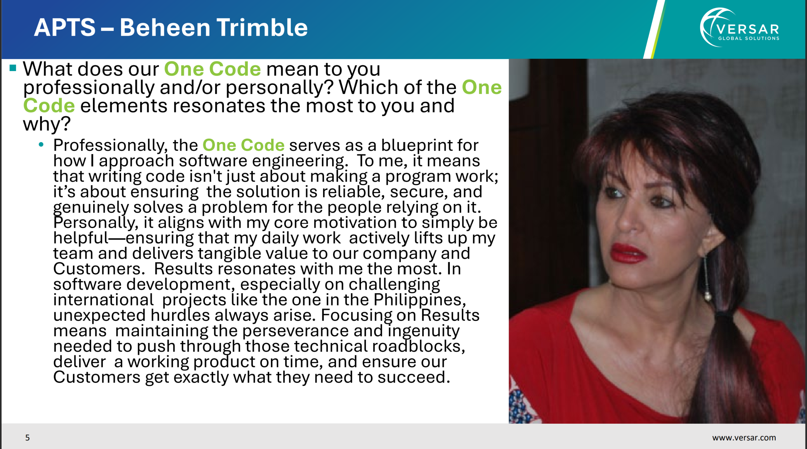 

  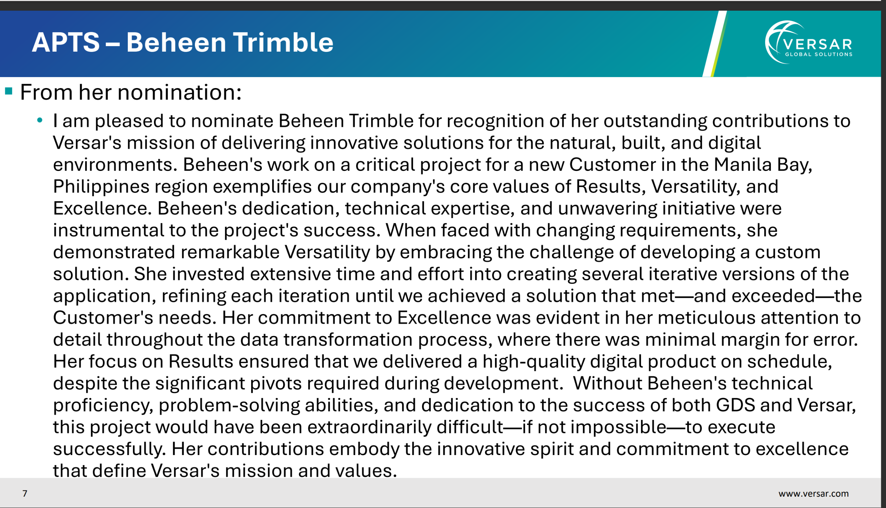

 

  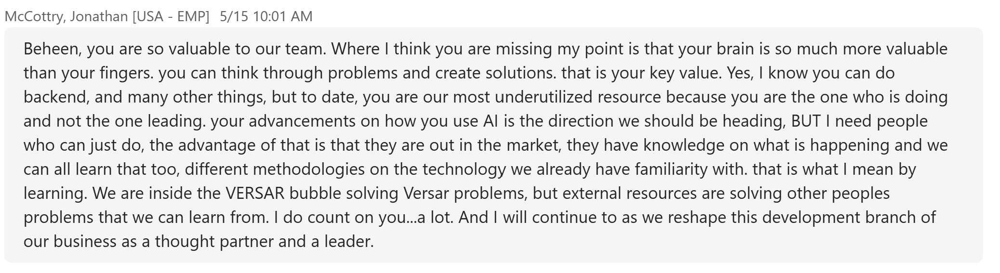

