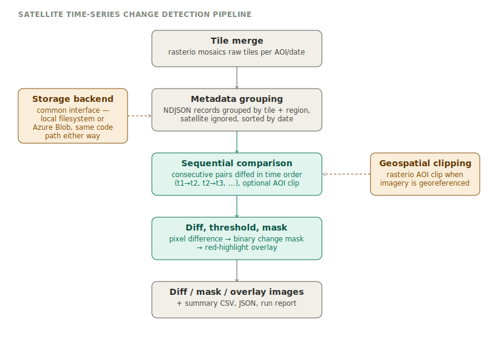

[← Back to interview prep](interview_prep_full.md#bonus-satellite-change-detection-diagram-future-roles-not-this-jd)

# Satellite time-series change detection pipeline

*Note: this is a personal/prototype project, kept separate from the current backend role's prep —
useful to have documented for future geospatial intelligence, remote sensing, or disaster-response
analytics roles.*

## What it does
Detects pixel-level change between two or more satellite images of the same location taken at
different times — the general technique behind before/after damage assessment, flood extent
mapping, deforestation tracking, or urban change monitoring. Takes raw satellite tiles and
metadata in, produces difference maps, binary change masks, visual overlays, and summary reports
out.

## Architecture, stage by stage
1. **Tile merge** — raw satellite tiles for a given AOI and date are mosaicked into a single
   full-frame GeoTIFF using `rasterio.merge`, grouped by a filename pattern encoding
   before/after, sequence, and date.
2. **Metadata grouping** — image records (from NDJSON/JSONL/JSON metadata) are grouped by tile and
   region — satellite platform is deliberately ignored at this stage so images from different
   satellites covering the same location can still be paired — then sorted chronologically.
3. **Sequential comparison** — for a time series of images at one location, consecutive pairs are
   compared in order (t1→t2, t2→t3, …) rather than every-pair-against-every-pair, which keeps the
   output meaningful as a timeline rather than a combinatorial mess. AOI clipping is applied when
   the imagery is georeferenced.
4. **Diff, threshold, mask** — a pixel-wise absolute difference is computed between each pair,
   thresholded into a binary change mask, and rendered as a red-highlight overlay on the base
   image for quick visual review.
5. **Output** — per-pair diff/mask/overlay images, plus a CSV and JSON summary and a run report
   for QA and downstream automation.

A storage abstraction sits underneath the whole pipeline: the same processing code runs against
either a local directory or an Azure Blob Storage container, selected by a CLI flag — the
comparison logic doesn't know or care which one it's reading from.

## Honest framing
This is a prototype, not production infrastructure, and it's explicitly *not* built for this
backend role's JD — no Django/FastAPI/task queues here, and it's currently pixel-based rather than
truly geospatial-aware for non-georeferenced formats (a known, documented limitation in the
project's own README). Its value is as a demonstration of remote-sensing/geospatial analysis
capability and the same storage-abstraction instinct that shows up in your other projects — worth
having on hand if a future role is geospatial-intelligence or remote-sensing flavored, not this one.
